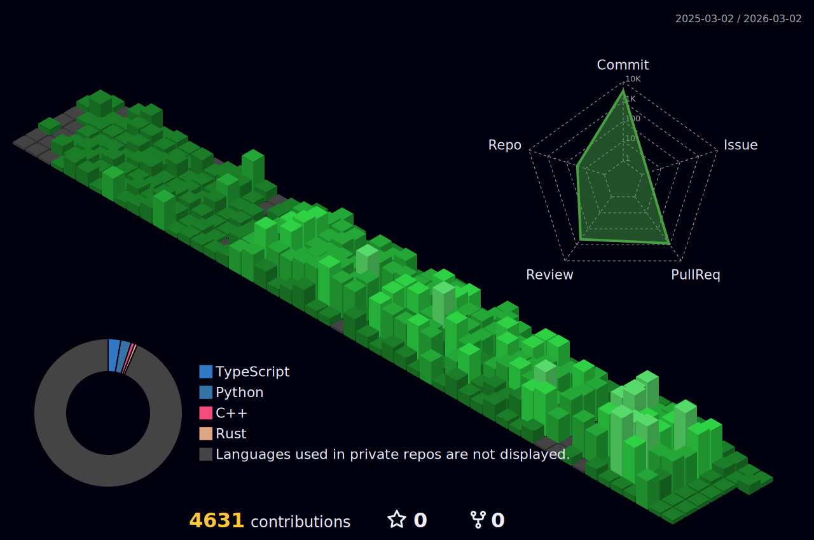

<h2> Hello World, 👋 </h2>

This is Tommy, Member of technical stuff <a href="https://www.expertise.ai/">@Expertise AI</a>, also a tech savvy.

Passionate about new technologies, your DO ANYTHING software engineer, curiosity is my power🔋 source.

Not much to say, talk is cheap, I'll show you my ~~AI agent's~~ code.
<!-- - 👯 I’m looking to collaborate on ...
- 🤔 I’m looking for help with ...
- 💬 Ask me about ... 
- 📫 How to reach me: dev@qstommyshu.com -->
<!-- - 😄 Pronouns: ...
- ⚡ Fun fact: ...  -->

  

  
<!--   - 🔭 I’m currently working on ... -->
- 🔭 I'm recently playing around with OpenClaw 🦞
- 🌱 I’m exploring how to use Claude Code more efficiently
- 🤖 Occasionally contribute to Open Source projects for fun
<!-- - 🌱 I’m currently learning Database implementations, and gRPC for distributed systems (checkout [my blog posts](https://qstommyshu.github.io/posts/gRPC-Introduction-(chapter-1)/)) -->
<!-- - Recently finished reading <a href="https://beej.us/guide/bgnet/html/split/index.html">Beej's Guide to network programming</a> (Very good introductory book for network programming) -->
<!-- - Currently reading <a href="https://rust-for-rustaceans.com/">Rust for Rustaceans</a>, <a href="https://www.databass.dev/">Database Internals</a> -->
<!-- - Casually reading DBMS by by R. Ramakrishnan, J. Gehrke
    -->
<!--     -->
 Cheers,
  
 Tommy Shu
 

<!--   <a href="https://www.linkedin.com/in/qi-shu/"> 
 -->
